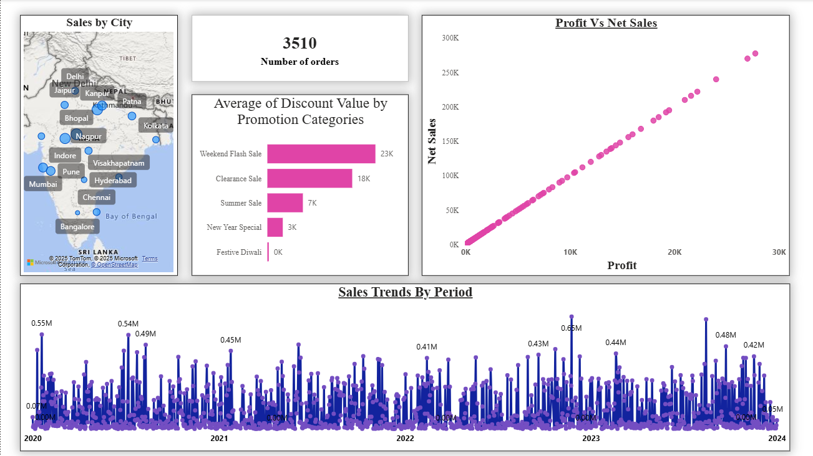
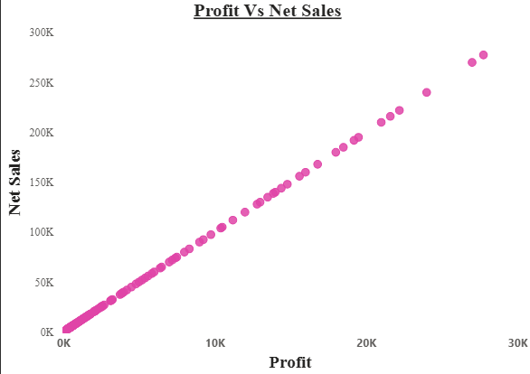
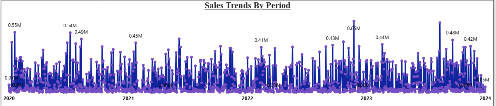

# 🛒 ElectroHub Store Data Analysis - Power BI Dashboard  

  
  
 

I accomplished something remarkable with my latest **Power BI project for ElectroHub** 🚀  

This dashboard transforms **raw store sales data** into **actionable insights** that empower strategic decisions.  

---

## 🔄 Data Transformation Achievements 💫
1. Excel data cleaning and standardization  
2. Star schema implementation for optimal performance  
3. Advanced DAX calculations for real-time metrics  
4. Dynamic filtering and aggregation systems  

---

## 📊 Key Business Insights Delivered
- 📦 **Product category performance tracking**  
- 🌍 **Regional sales trend analysis**  
- 👥 **Customer loyalty & repeat purchase identification**  
- 💰 **Profit margin optimization strategies**  

---

## 💡 Technical Components Mastered
- Data cleaning protocols  
- Performance optimization in Power BI  
- Interactive visualization design  
- Strategic metric tracking with DAX  

---

## 📈 Results Achieved
1. Clear sales performance visibility  
2. Precise profit margin analysis  
3. Detailed customer segmentation  
4. Regional growth mapping  

---

## ⚡ Tools Employed
- **Power BI Desktop** → for comprehensive data analysis & visualization  
- **DAX (Data Analysis Expressions)** → for calculated KPIs  
- **Excel** → for staging & cleaning raw store data  

---

## 📸 Dashboard Preview

### 🔹 Overview Page  
  

### 🔹 Map Visual (Regional Sales Distribution)  
  

### 🔹 Trends Visual (Sales Over Time)  
  
 

### 🔹 Table Visual
 


## 🚀 Features
- **Dynamic filters** → Drill down by category, region, or customer segment  
- **Visual storytelling** → KPIs, charts & insights designed for decision-making  
- **Interactive reports** → Easy navigation between overview & details  
- **Optimized star schema** → Fast and efficient data model  

---

## 🛠 Getting Started

### ✅ Prerequisites
- [Power BI Desktop](https://powerbi.microsoft.com/desktop/)  

### ⚙️ Installation
1. Clone this repo:
   ```bash
   git clone https://github.com/gmule014-dotcom/ElectroHub-Store-Analysis.git
